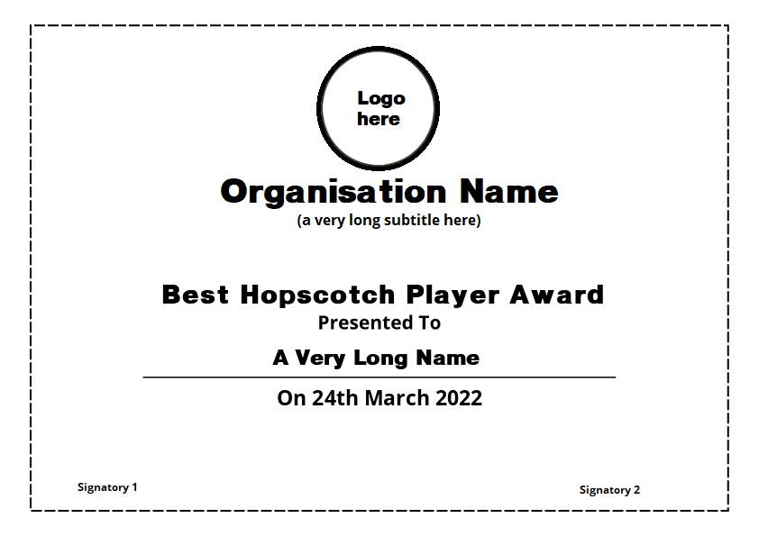
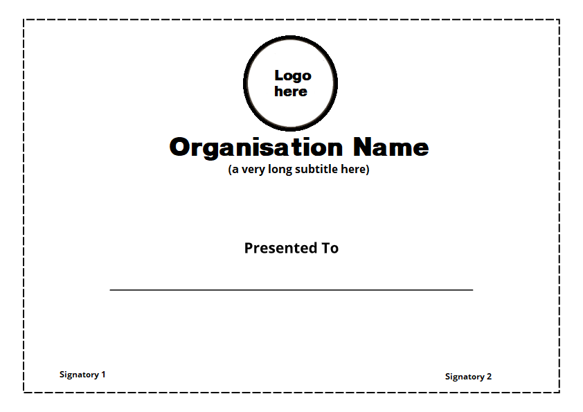
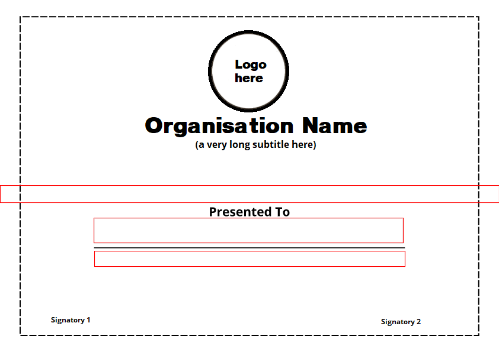

# Certificate Generator

- Originally made for use for New Delhi Gavels Club.

## An example interaction:
```
Enter recipient name: A Very Long Name
Enter date: 24th March 2022
1: Best Hopscotch Player Award
2: Most Creative Painting Award
Please enter certificate (number): 1
```

Output:



This is what the default template looks like:



You can change `template.png` to a custom certificate as well.

## What is this doing?

The program takes input for name, date, and certificate types, and writes them on an image created from `template.png`.

- Scales excessively long field names to fit predefined boxes.
- Auto-centers and aligns text fields.
- Generates multiple certificates from a single template.

## Creating Custom Bounding Boxes

Best way to determine coordinates is to go
in Paint and draw a box around all the text, then note the coordinates you start,
and the point where your cursor stops.

You can be very generous with the boxes.

For example, these are the default bounding boxes for the sample certificate.



You can mess with the fonts, font sizes, spacing and define custom bounding boxes in [main.py](main.py).